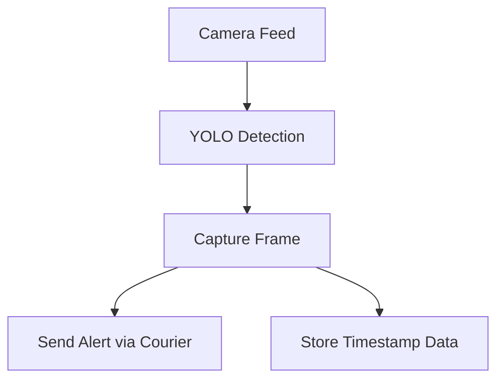

# ML Integrated - Surveillance System
### Real-Time Object Detection + Instant Alerts + Crime Forecasting

> What if your camera could detect suspicious activity  
> and notify you instantly?

This project combines **YOLOv8 object detection**, **OpenCV live capture**, **Courier alerting (Email/SMS)**, and **ARIMA crime forecasting** into one integrated surveillance pipeline.

---

## So what does our system do? 

When the system detects an object:

1. YOLOv8 identifies the object in real time  
2. OpenCV captures the frame  
3. A timestamp is logged  
4. An alert is sent via Courier  

## And what about the forecasting?

1. ARIMA/ARIMAX model forecasts future crime trends.
2. Leverage these insights into creating a product.

---

## System Architecture



---

## 💡 Why I Built This

I wanted to understand:

> How do we go from a simple idea  
> to something that actually feels like a product?

I didn't want to create another tutorial project, rather: 

I focused on:
- Integrating powerful existing tools correctly
- Managing environment variables securely
- Connecting real-time detection to real-world alerts
- Supporting the concept with data forecasting (ARIMA)

---

# Installation & Setup

---

## System Capture Dependencies

<details>
<summary>Click to expand</summary>

### 1️⃣ YOLO (Ultralytics)
```bash
pip install -U ultralytics
```

### 2️⃣ Courier (Email / SMS Alerts)
Create an account at: https://www.courier.com/

```bash
pip install trycourier
```

### 3️⃣ OpenCV (Camera Capture)
```bash
pip install opencv-contrib-python
```

### 4️⃣ dotenv (Environment Variables)
```bash
pip install python-dotenv
```

### 5️⃣ Built-in Modules
```python
from datetime import datetime
import time
```

</details>

---

## Jupyter Notebook Dependencies (Crime Forecasting)

<details>
<summary>Click to expand</summary>

### Pandas
```bash
pip install pandas
```

### Matplotlib
```bash
pip install matplotlib
```

### StatsModels (ARIMA)
```bash
pip install -U statsmodels==0.14.4 scipy==1.14.1
```

</details>

---

# Environment Configuration

## Step 1: Create a `.env` file

```env
COURIER_API_KEY=your_api_key_here
EMAIL=your_email_here
```

Why use a `.env` file?

- Keeps API keys secure  
- Prevents accidental GitHub exposure  
- Separates configuration from source code  

---

## Step 2: config.py (Included in Source)

```python
from dotenv import load_dotenv
import os 

load_dotenv()

API_KEY = os.getenv("COURIER_API_KEY")
USER_EMAIL = os.getenv("EMAIL")
```

---

# Run with Docker (Quick Start)

```bash
docker build -t surveillanceproject .
docker run surveillanceproject
```

⚠️ Ensure your `.env` file is properly configured before running.

---

# Crime Forecasting with ARIMA

<details>
<summary>Why forecasting?</summary>


Using an ARIMA model, I analysed Australian crime data to predict future trends.

This complements the surveillance system by providing context:

If crime trends increase → surveillance demand logically increases.

</details>

---

# Tech Stack

| Component          | Tool Used            |
|-------------------|----------------------|
| Object Detection  | YOLOv8 (Ultralytics) |
| Camera System     | OpenCV               |
| Alerts            | Courier API          |
| Forecasting       | ARIMA (StatsModels)  |
| Containerization  | Docker               |
| Env Management    | python-dotenv        |

---

# Future Improvements

- [ ] Train a custom YOLO model  
- [ ] Store detections in database  (SQL)
- [ ] Add app/web dashboard  
- [ ] Real-time streaming interface  

---
